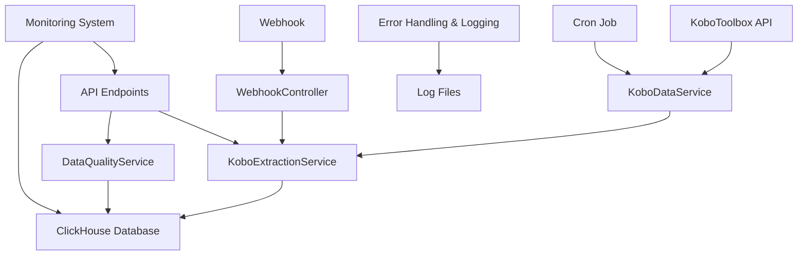
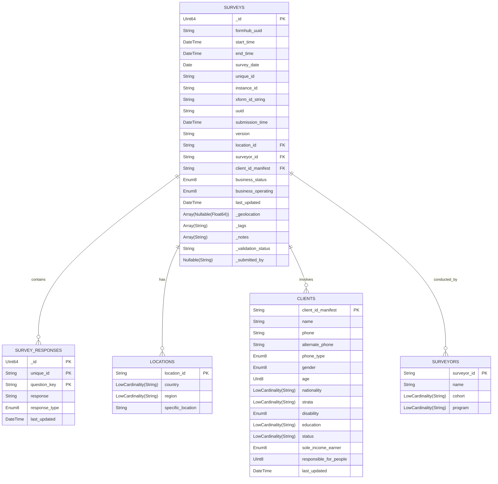

# 📊 KoboSync Data Extraction System

## Table of Contents

- [📊 KoboSync Data Extraction System](#-kobosync-data-extraction-system)
  - [Table of Contents](#table-of-contents)
  - [🚀 Project Overview](#-project-overview)
    - [What You'll Love About It:](#what-youll-love-about-it)
  - [💡 Key Decisions and Rationale](#-key-decisions-and-rationale)
  - [🛠️ System Architecture](#️-system-architecture)
  - [🗄️ Database Schema](#️-database-schema)
    - [Schema Diagram](#schema-diagram)
    - [SQL Schema](#sql-schema)
  - [🛠️ Setup Instructions](#️-setup-instructions)
    - [Prerequisites:](#prerequisites)
    - [Configuration:](#configuration)
  - [Setup Instructions](#setup-instructions)
    - [Deployment:](#deployment)
    - [Testing:](#testing)
  - [📚 Usage Guide](#-usage-guide)
    - [Extracting Data](#extracting-data)
    - [Viewing Data Quality Issues](#viewing-data-quality-issues)
    - [Webhook for Real-time Updates](#webhook-for-real-time-updates)
    - [Surveys List](#surveys-list)
  - [📖 API Documentation](#-api-documentation)
  - [✅ Data Quality Checks](#-data-quality-checks)
  - [⚡ Real-time Processing](#-real-time-processing)
    - [Webhook Workflow:](#webhook-workflow)
  - [🧪 Testing](#-testing)
    - [Test Types:](#test-types)
  - [🚀 Performance Optimization](#-performance-optimization)
    - [Key Optimizations:](#key-optimizations)

---

## 🚀 Project Overview

Welcome to the **KoboSync Data Extraction System**! This project is all about making it easier to extract, process, and store survey data from KoboToolbox. We built it with performance and scalability in mind, so whether you’re dealing with a handful of surveys or thousands, this system has you covered.

### What You'll Love About It:

- **Lightning-fast** data extraction thanks to ClickHouse
- Real-time updates via **webhooks**
- **Rock-solid** data quality checks to keep everything in check
- **Daily scheduled extractions** so you don’t have to worry about missing any data
- **Built to scale** as your data grows

---

## 💡 Key Decisions and Rationale

Here’s a quick rundown of some key choices I made while building this system and why:

1. **Database Choice: ClickHouse**
   - **Why?** We picked ClickHouse because it’s awesome at handling large datasets and running analytical queries quickly. Perfect for the kind of heavy lifting that's needed.

2. **Data Model: Normalized Structure**
   - **Why?** A normalized structure keeps the data clean, makes queries faster, and reduces redundancy. It also makes future updates and maintenance much easier.

3. **Real-time Processing: Webhook Implementation**
   - **Why?** We added a webhook so that every time a new survey submission comes in, it gets processed immediately. No waiting around!

4. **Data Quality: Comprehensive Checks**
   - **Why?** Data quality is non-negotiable. We implemented checks at multiple stages to ensure the data is reliable and accurate.

5. **Asynchronous Processing: FastAPI and asyncio**
   - **Why?** FastAPI with asyncio lets us handle multiple tasks at once without slowing down. This makes the system more responsive.

6. **Scalability: Distributed Architecture**
   - **Why?** We designed it to scale horizontally, so as your data grows, the system can easily grow with it.

7. **Error Handling and Logging: Comprehensive Approach**
   - **Why?** Good logging and error handling make it easier to troubleshoot issues and keep everything running smoothly.

8. **Testing: Comprehensive Test Suite**
   - **Why?** We set up a full suite of tests to make sure everything works as expected and to catch any issues early.

9. **Security: Multiple Layers**
   - **Why?** Security is key, so I implemented several layers of protection to keep your data safe.

10. **Performance Optimization: ClickHouse-Specific Techniques**
    - **Why?** We wanted to get the most out of ClickHouse, so I used some of its unique features to optimize performance even further.

---

## 🛠️ System Architecture

Let’s take a quick look at how everything fits together:



Everything starts with KoboToolbox. I extracted the data using `KoboService`, store it in ClickHouse, and then handle it through our API or process it in real-time via the webhook.

---

## 🗄️ Database Schema

### Schema Diagram

Here’s a visual representation of how our data is structured:



### SQL Schema

And here’s how that schema looks in SQL:

```sql
CREATE TABLE surveys
(
    _id UInt64,
    formhub_uuid String,
    start_time DateTime,
    end_time DateTime,
    survey_date Date,
    unique_id String,
    instance_id String,
    xform_id_string String,
    uuid String,
    submission_time DateTime,
    version String,
    location_id String,
    surveyor_id String,
    client_id_manifest String,
    business_status Enum8('Existing Business' = 1, 'New Business' = 2, 'Idea stage' = 3),
    business_operating Enum8('yes' = 1, 'no' = 0),
    last_updated DateTime,
    _geolocation Array(Nullable(Float64)),
    _tags Array(String),
    _notes Array(String),
    _validation_status String,
    _submitted_by Nullable(String)
) ENGINE = ReplacingMergeTree(last_updated)
ORDER BY (_id, unique_id, client_id_manifest, submission_time);

CREATE TABLE locations
(
    location_id String,
    country LowCardinality(String),
    region LowCardinality(String),
    specific_location String
) ENGINE = ReplacingMergeTree()
ORDER BY location_id;

CREATE TABLE clients
(
    client_id_manifest String,
    name String,
    phone String,
    alternate_phone String,
    phone_type Enum8('Smart phone' = 1, 'Feature phone' = 2, 'Smart phone Feature phone' = 3),
    gender Enum8('Male' = 1, 'Female' = 2),
    age UInt8,
    nationality LowCardinality(String),
    strata LowCardinality(String),
    disability Enum8('Yes' = 1, 'No' = 0),
    education LowCardinality(String),
    status LowCardinality(String),
    sole_income_earner Enum8('Yes' = 1, 'No' = 0),
    responsible_for_people UInt8,
    last_updated DateTime
) ENGINE = ReplacingMergeTree(last_updated)
ORDER BY client_id_manifest;

CREATE TABLE surveyors
(
    surveyor_id String,
    name String,
    cohort LowCardinality(String),
    program LowCardinality(String)
) ENGINE = ReplacingMergeTree()
ORDER BY surveyor_id;

CREATE TABLE survey_responses
(
id UInt64,
    unique_id String,
    question_key String,
    response String,
    response_type Enum8('text' = 1, 'number' = 2, 'date' = 3, 'select' = 4),
    last_updated DateTime
) ENGINE = ReplacingMergeTree(last_updated)
ORDER BY (_id, unique_id, question_key);
```

---

## 🛠️ Setup Instructions

### Prerequisites:
Before you dive in, make sure you have the following installed:

- **Docker** and **Docker Compose**
- **ClickHouse** and **FastAPI** dependencies (grab them from the `requirements.txt`)

### Configuration:

## Setup Instructions

1. Clone the repository:
   ```
   git clone https://github.com/Jajabenit250/kobosync-for-inkomoko.git
   cd kobosync-for-inkomoko
   ```

2. Install ClickHouse:
   Follow the official ClickHouse installation guide for your operating system.

3. Create a virtual environment and activate it:
   ```
   python -m venv venv
   source venv/bin/activate  # On Windows, use `venv\Scripts\activate`
   ```

4. Install dependencies:
   ```
   pip install -r requirements.txt
   ```

5. Set up environment variables:
   Create a `.env` file in the root directory and add the following:
   ```
   KOBO_API_TOKEN=your_kobo_api_token
   CLICKHOUSE_HOST=localhost
   CLICKHOUSE_PORT=9000
   CLICKHOUSE_USER=default
   CLICKHOUSE_PASSWORD=
   CLICKHOUSE_DATABASE=kobo_extraction
   ```
6. Initialize the ClickHouse database:
   Run the SQL scripts in `database_init.sql` to create the necessary tables.

7. Start the application:
   ```
   uvicorn src.main:app --reload
   ```

### Deployment:
1. Fire up the containers with `docker-compose up -d`.

### Testing:
1. Run tests with `pytest` to make sure everything’s working as expected.
2. Use the provided Postman collection to test out the API endpoints.

---

## 📚 Usage Guide

### Extracting Data
To pull data from KoboToolbox manually, hit up the `/kobo/extract` endpoint. All the data will be stored in the ClickHouse tables.

### Viewing Data Quality Issues
Need to check for any data quality issues? The `/data-quality/check` endpoint has got you covered.

### Webhook for Real-time Updates
If you want to get data as soon as it’s submitted, make sure to register your webhook URL with KoboToolbox.

### Surveys List
Want to see a list of all the surveys in the system? Just call the `/surveys` endpoint.

---

## 📖 API Documentation
- Documentation can be found here http://52.54.67.242:3030/docs#/

## ✅ Data Quality Checks

2. **Value Range Checks**: Ensures that numeric fields fall within acceptable ranges. For example, ages or response counts are checked to make sure they're realistic.
3. **Date Consistency**: Verifies that date fields, such as `submission_time`, `start_time`, and `end_time`, make sense chronologically.
4. **Geolocation Validation**: Confirms that geolocation data falls within valid latitude and longitude ranges.
5. **Unique Constraint Checks**: Ensures that fields like `unique_id` remain unique across the dataset.
6. **Cross-field Validation**: Looks at the relationships between fields to ensure they make sense together, like making sure `end_time` is after `start_time`.

---

## ⚡ Real-time Processing

Our system is designed to handle real-time data processing efficiently. As soon as a new survey submission is made, it's captured by the webhook and processed immediately, updating the database and running data quality checks on the fly. This ensures that your data is always up-to-date and ready for analysis.

### Webhook Workflow:
1. **Kobo Submission**: A new submission is made in KoboToolbox.
2. **Webhook Triggered**: The webhook captures the submission and sends it to our system.
3. **Processing & Storage**: The data is validated, processed, and stored in ClickHouse.
4. **Data Quality Checks**: All quality checks are run to ensure the data is accurate and consistent.

---

## 🧪 Testing

Testing is a core part of our development process. I did implemented a comprehensive suite of tests to ensure the system works as expected under different scenarios.

### Test Types:
- **Unit Tests**: Check individual components to ensure they perform as expected.

---

## 🚀 Performance Optimization

Performance is key, especially when dealing with large datasets. We’ve implemented several optimizations to keep things running fast and smooth:

### Key Optimizations:
- **Indexing**: Strategic indexing in ClickHouse to speed up queries.
- **Batch Processing**: Data is processed in batches where possible, reducing the load on the system.
- **Asynchronous Operations**: Utilizing FastAPI’s async capabilities to handle multiple requests concurrently without slowing down.
- **Caching**: Frequently accessed data is cached to reduce the need for repetitive database queries.
- **Connection Pooling**: Efficiently managing database connections to prevent bottlenecks.

---

