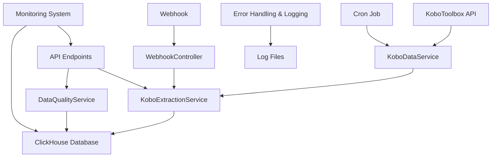
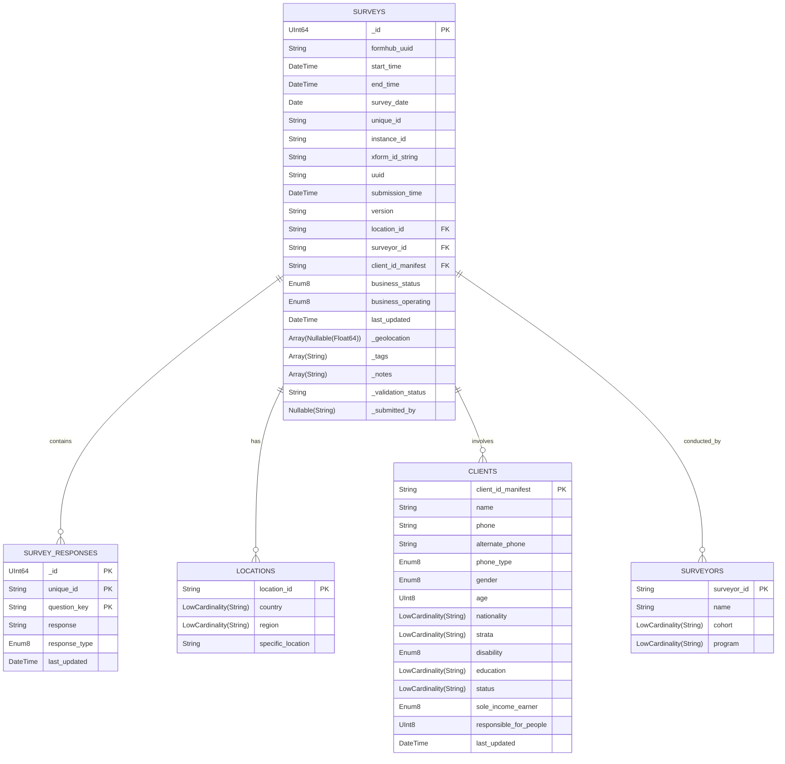

# KoboSync Data Extraction System: Comprehensive Documentation

## Table of Contents
- [KoboSync Data Extraction System: Comprehensive Documentation](#kobosync-data-extraction-system-comprehensive-documentation)
  - [Table of Contents](#table-of-contents)
  - [1. Project Overview](#1-project-overview)
  - [2. Key Decisions and Rationale](#2-key-decisions-and-rationale)
  - [3. System Architecture](#3-system-architecture)
  - [4. Database Schema](#4-database-schema)
    - [Schema Diagram](#schema-diagram)
    - [SQL Schema](#sql-schema)
  - [5. Setup Instructions](#5-setup-instructions)
  - [6. Usage Guide](#6-usage-guide)
    - [Extracting Data](#extracting-data)
    - [Viewing Data Quality Issues](#viewing-data-quality-issues)
    - [Webhook for Real-time Updates](#webhook-for-real-time-updates)
  - [7. API Documentation](#7-api-documentation)
    - [Kobo Extraction Endpoints](#kobo-extraction-endpoints)
    - [Data Quality Endpoints](#data-quality-endpoints)
  - [8. Data Quality Checks](#8-data-quality-checks)
  - [9. Real-time Processing](#9-real-time-processing)
  - [10. Cron Jobs](#10-cron-jobs)
  - [11. Error Handling and Logging](#11-error-handling-and-logging)
  - [12. Testing](#12-testing)
  - [13. Performance Optimization](#13-performance-optimization)
  - [14. Monitoring and Maintenance](#14-monitoring-and-maintenance)
  - [15. Security Considerations](#15-security-considerations)
  - [16. Troubleshooting](#16-troubleshooting)

## 1. Project Overview

The KoboToolbox Data Extraction System is designed to efficiently extract, process, and store large volumes of survey data from KoboToolbox. It provides real-time updates, ensures data quality, and offers a scalable architecture for handling growing datasets.

Key Features:
- Efficient data extraction from KoboToolbox API
- ClickHouse integration for high-performance data storage and querying
- Real-time updates via webhooks
- Comprehensive data quality checks
- Scheduled daily extractions
- Scalable architecture for handling large datasets

## 2. Key Decisions and Rationale

1. **Database Choice: ClickHouse**
   - Decision: Used ClickHouse instead of a traditional relational database.
   - Rationale: Optimized for analytical queries on large datasets, offering faster aggregations and better compression.

2. **Data Model: Normalized Structure**
   - Decision: Created separate tables for surveys, locations, clients, surveyors, and survey responses instead of using the original sec_a, sec_b, sec_c structure.
   - Rationale: 
     a. Better query performance
     b. Reduced data redundancy
     c. Easier maintenance
     d. Flexibility for future changes

3. **Real-time Processing: Webhook Implementation**
   - Decision: Implemented a webhook endpoint for real-time data updates.
   - Rationale: Ensures immediate processing of new survey submissions.

4. **Data Quality: Comprehensive Checks**
   - Decision: Implemented extensive data quality checks at both insertion and query time.
   - Rationale: Ensures data integrity and reliability.

5. **Asynchronous Processing: FastAPI and asyncio**
   - Decision: Used FastAPI and asyncio for asynchronous operations.
   - Rationale: Improves concurrency and system responsiveness.

6. **Scalability: Distributed Architecture**
   - Decision: Designed the system to be horizontally scalable.
   - Rationale: Allows for easy expansion to handle increasing data volumes.

7. **Error Handling and Logging: Comprehensive Approach**
   - Decision: Implemented detailed error handling and logging.
   - Rationale: Facilitates easier debugging and monitoring.

8. **Testing: Comprehensive Test Suite**
   - Decision: Created an extensive test suite.
   - Rationale: Ensures system reliability and helps catch issues early.

9. **Security: Multiple Layers**
   - Decision: Implemented various security measures.
   - Rationale: Protects sensitive survey data and prevents unauthorized access.

10. **Performance Optimization: ClickHouse-Specific Techniques**
    - Decision: Utilized ClickHouse-specific optimizations.
    - Rationale: Leverages ClickHouse's full power for faster queries and efficient storage.

## 3. System Architecture



## 4. Database Schema

### Schema Diagram



### SQL Schema

```sql
CREATE TABLE surveys
(
    _id UInt64,
    formhub_uuid String,
    start_time DateTime,
    end_time DateTime,
    survey_date Date,
    unique_id String,
    instance_id String,
    xform_id_string String,
    uuid String,
    submission_time DateTime,
    version String,
    location_id String,
    surveyor_id String,
    client_id_manifest String,
    business_status Enum8('Existing Business' = 1, 'New Business' = 2, 'Not Operating' = 3),
    business_operating Enum8('yes' = 1, 'no' = 0),
    last_updated DateTime,
    _geolocation Array(Nullable(Float64)),
    _tags Array(String),
    _notes Array(String),
    _validation_status String,
    _submitted_by Nullable(String)
) ENGINE = ReplacingMergeTree(last_updated)
ORDER BY (_id, unique_id, client_id_manifest, submission_time);

CREATE TABLE locations
(
    location_id String,
    country LowCardinality(String),
    region LowCardinality(String),
    specific_location String
) ENGINE = ReplacingMergeTree()
ORDER BY location_id;

CREATE TABLE clients
(
    client_id_manifest String,
    name String,
    phone String,
    alternate_phone String,
    phone_type Enum8('Smart phone' = 1, 'Feature phone' = 2, 'Basic phone' = 3),
    gender Enum8('Male' = 1, 'Female' = 2),
    age UInt8,
    nationality LowCardinality(String),
    strata LowCardinality(String),
    disability Enum8('Yes' = 1, 'No' = 0),
    education LowCardinality(String),
    status LowCardinality(String),
    sole_income_earner Enum8('Yes' = 1, 'No' = 0),
    responsible_for_people UInt8,
    last_updated DateTime
) ENGINE = ReplacingMergeTree(last_updated)
ORDER BY client_id_manifest;

CREATE TABLE surveyors
(
    surveyor_id String,
    name String,
    cohort LowCardinality(String),
    program LowCardinality(String)
) ENGINE = ReplacingMergeTree()
ORDER BY surveyor_id;

CREATE TABLE survey_responses
(
    _id UInt64,
    unique_id String,
    question_key String,
    response String,
    response_type Enum8('text' = 1, 'number' = 2, 'choice' = 3, 'multiple_choice' = 4, 'date' = 5),
    last_updated DateTime
) ENGINE = ReplacingMergeTree(last_updated)
ORDER BY (_id, unique_id, question_key);
```

## 5. Setup Instructions

1. Clone the repository:
   ```
   git clone https://github.com/Jajabenit250/kobosync-for-inkomoko.git
   cd kobosync-for-inkomoko
   ```

2. Install ClickHouse:
   Follow the official ClickHouse installation guide for your operating system.

3. Create a virtual environment and activate it:
   ```
   python -m venv venv
   source venv/bin/activate  # On Windows, use `venv\Scripts\activate`
   ```

4. Install dependencies:
   ```
   pip install -r requirements.txt
   ```

5. Set up environment variables:
   Create a `.env` file in the root directory and add the following:
   ```
   KOBO_API_TOKEN=your_kobo_api_token
   CLICKHOUSE_HOST=localhost
   CLICKHOUSE_PORT=9000
   CLICKHOUSE_USER=default
   CLICKHOUSE_PASSWORD=
   CLICKHOUSE_DATABASE=kobo_extraction
   ```

6. Initialize the ClickHouse database:
   Run the SQL scripts in `database_init.sql` to create the necessary tables.

7. Start the application:
   ```
   uvicorn src.main:app --reload
   ```

## 6. Usage Guide

### Extracting Data
- To manually trigger a data extraction, send a GET request to `/kobo-extraction/extract`
- The system will automatically extract data daily using a cron job

### Viewing Data Quality Issues
- Send a GET request to `/data-quality/issues` to view current data quality issues
- To run a new data quality check, send a POST request to `/data-quality/check`

### Webhook for Real-time Updates
- Set up a webhook in KoboToolbox pointing to `/kobo-extraction/webhook`
- The system will process incoming data in real-time

## 7. API Documentation

### Kobo Extraction Endpoints
- `GET /kobo-extraction/extract`: Triggers a manual data extraction
- `POST /kobo-extraction/webhook`: Endpoint for KoboToolbox webhook

### Data Quality Endpoints
- `GET /data-quality/issues`: Retrieves current data quality issues
- `POST /data-quality/check`: Runs a new data quality check

## 8. Data Quality Checks

The system performs the following data quality checks:
- Missing required fields
- Invalid data formats (e.g., dates, UUIDs)
- Logical inconsistencies (e.g., end time before start time)
- Data range validations (e.g., age limits)
- Duplicate entries
- Geolocation validity
- Enum value validations

## 9. Real-time Processing

The webhook endpoint `/kobo-extraction/webhook` handles real-time updates:
- Validates incoming data
- Processes and stores new survey data
- Updates existing records if necessary
- Triggers data quality checks on new data

## 10. Cron Jobs

A daily cron job is set up to:
- Extract new data from KoboToolbox
- Perform data quality checks
- Optimize ClickHouse tables

To modify the cron schedule, edit the `crontab` file:
```
0 0 * * * /path/to/your/python /path/to/your/script.py
```

## 11. Error Handling and Logging

- All exceptions are caught and logged
- Logs are stored in `/var/log/kobo-extraction/`
- Log levels: INFO for normal operations, ERROR for exceptions
- Separate log files for application errors and data quality issues

## 12. Testing

Run the test suite using pytest:
```
pytest
```

The test suite includes:
- Unit tests for all services
- Integration tests for ClickHouse operations
- API endpoint tests
- Data quality check tests
- Concurrency and performance tests

## 13. Performance Optimization

- Use of ClickHouse's columnar storage for efficient data retrieval
- Implemented data partitioning and indexing strategies
- Asynchronous processing for API requests and data extraction
- Batch inserts for improved write performance

## 14. Monitoring and Maintenance

- Regular backups of ClickHouse data
- Monitoring of system resources (CPU, memory, disk usage)
- API endpoint health checks
- Performance metric collection (request latency, data processing time)

## 15. Security Considerations

- Use of environment variables for sensitive configuration
- Implementation of rate limiting on API endpoints
- Regular security audits and dependency updates
- Data encryption for sensitive information
- Access control and authentication for API endpoints

## 16. Troubleshooting

Common issues and their solutions:
- API Connection Errors: Check your internet connection and verify the API token
- ClickHouse Errors: Ensure ClickHouse is running and the connection details are correct
- Webhook Errors: Verify the webhook URL in KoboToolbox settings
- Data Quality Issues: Review the data quality logs and adjust checks if necessary

For further assistance, please open an issue on the GitHub repository.
